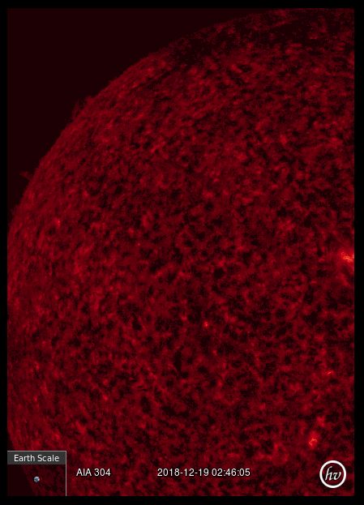

## MMM-SunWorship

A rather unspectacular module that displays current images of the sun.

The images are timestamped (Zulu time) and update about every hour.

Images are current to within one hour. Kinda cool.

Earth scale at bottom left of images makes you realize just how small we really are.

## Examples

## Installation

* `git clone https://github.com/mykle1/MMM-SunWorship.git` into the `~/MagicMirror/modules` directory.

* No API needed!

## Config.js entry and options

    {
        disabled: false,
        module: "MMM-SunWorship",
        position: "top_left",
        config: {
            maxWidth: "100%",       // Sizes the images. Retains aspect ratio.
            updateInterval: 30 * 60 * 1000,
            animationSpeed: 3000, // transition speed at update time
      }
    },
	
## Why?

Because MMM-EARTH and MMM-Lunartic needed some sunshine

